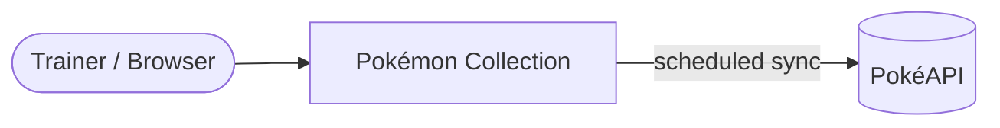
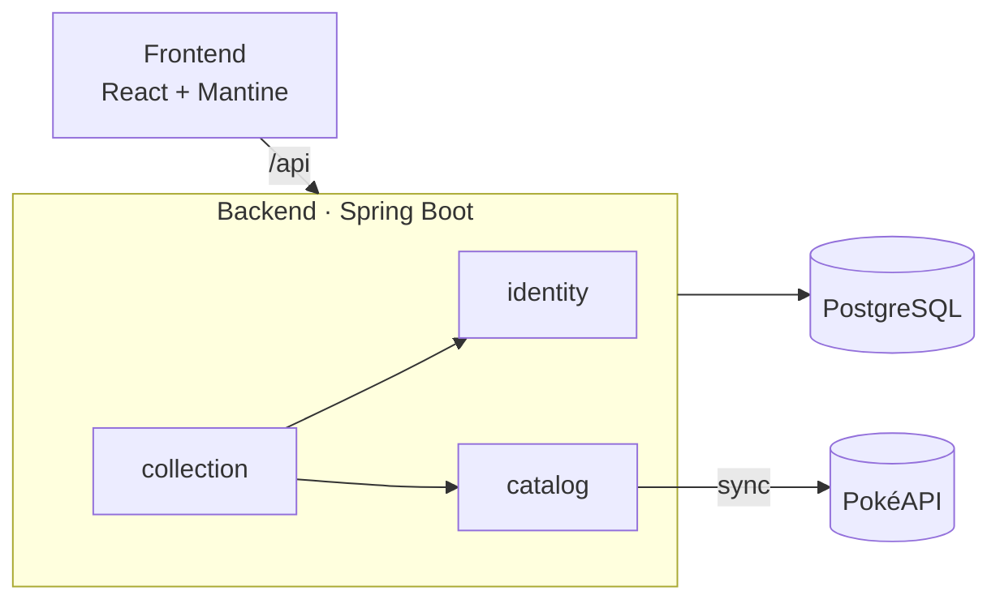

# Pokémon Collection – Architecture

## 1. Goals

Trainers register, log in, search the Pokémon catalog, add Pokémon to their own collection and view it.
Each Pokémon can be in a trainer's collection only once.

| Prio | Quality | Goal |
|------|---------|------|
| 1 | Security | A trainer only sees and changes their own collection. |
| 2 | Resilience | The app keeps working when PokéAPI is down. |
| 3 | Maintainability | Features are cheap to add and changes stay local. |
| 4 | Adaptability | Later changes (e.g. session → JWT, removing Pokémon from a collection) stay local. |
| 5 | Testability | Security, business logic and failure cases are testable. |

## 2. Context

PokéAPI is only called by the sync job, never during a user request.

## 3. Technology

| Area | Choice |
|------|--------|
| Backend | Java, Spring Boot, Spring Security, Spring Modulith |
| Frontend | React, TypeScript, Mantine, RTK Query (caching, cache invalidation after changes, polling) |
| Database | PostgreSQL; schema managed by Liquibase, Hibernate only validates it |
| API contract | OpenAPI (openapi-generator for the backend, `@rtk-query/codegen-openapi` for the frontend) |
| Runtime | Docker Compose |

## 4. Building Blocks

| Module | Responsibility |
|--------|----------------|
| `identity` | Registration, login/logout, Spring Security, current trainer ("user") |
| `catalog` | Local Pokémon data, scheduled PokéAPI sync, deprecation of Pokémon |
| `collection` | Collection entries of a trainer |

**Uniqueness:** A Pokémon can be in a trainer's collection only once. The primary key `(trainer_id, pokemon_id)`
enforces this; adding it again returns `409 Conflict`.

**Data model:** `trainer (id, username, password_hash)` · `pokemon (id, name, types, sprite_url, deprecated)` ·
`collection_entry (trainer_id, pokemon_id, added_at)`

**API** (defined in `api/openapi.yaml`):

| Endpoint | Purpose |
|----------|---------|
| `POST /api/auth/register` · `login` · `logout`, `GET /api/auth/me` | Authentication |
| `GET /api/pokemon` | List catalog (all non-deprecated Pokémon) |
| `GET /api/collection` | List own collection |
| `POST /api/collection` `{ pokemonId }` | Add a Pokémon to own collection |

Filtering and sorting of catalog and collection happen in the frontend; the datasets are small (~1,300 Pokémon).

## 5. Deployment

`docker compose up --build` starts everything; only Docker is needed on the host.

| Service | Content |
|---------|---------|
| `postgres` | PostgreSQL with a named volume |
| `backend` | Spring Boot (multi-stage build); runs Liquibase migrations on startup |
| `frontend` | nginx (multi-stage build): serves the SPA and proxies `/api` to the backend → one origin, no CORS |

## 6. Testing

There is currently no test coverage specified.

| Test | Covers |
|------|--------|
| Integration tests with Testcontainers (PostgreSQL) | Auth, CSRF, data isolation between two trainers, adding the same Pokémon twice → `409` |
| WireMock tests | Sync, PokéAPI outage, deprecation |
| Unit tests | Sync logic, including the mass-deprecation guard |
| Spring Modulith test | Module boundaries |
| Vitest | Key frontend components |

Testcontainers is used instead of H2, so queries and Liquibase migrations run against real PostgreSQL. Running the
tests requires Docker.

## 7. Architecture Decisions

### ADR-1 Modular Monolith
**Decision:** One Spring Boot app split into the modules `identity`, `catalog` and `collection`. Modules only use
each other's public interfaces; Spring Modulith checks this in a test.

**Trade-off:** Simple to build and run, with clear boundaries → shared runtime and DB, no independent scaling.

### ADR-2 Session-based Authentication
**Decision:** Spring Security with server-side sessions (HttpOnly cookie) and BCrypt password hashes. Other modules
only use a `CurrentTrainer` abstraction.
- CSRF protection uses a readable `XSRF-TOKEN` cookie that the frontend sends back as the `X-XSRF-TOKEN` header.
- nginx serves the SPA and proxies `/api`, so everything runs on one origin, with no CORS or cross-site cookies.

**Trade-off:** Simple and secure for a single same-origin SPA → stateful (sessions lost on restart). Switching to
other authentication methods later only affects `identity`.

### ADR-3 Authorization & Data Isolation
**Decision:** The trainer id comes **only from the session**, never from the request.
- There is no trainer id in any URL: `/api/collection` means "my collection".
- Every collection read and write is filtered by, or written with, the session's trainer id
  (`findAllByTrainerId`).

**Trade-off:** Users can't reach other trainers' data by changing an id in the request, and there are no
per-endpoint checks to forget → enforced in application code. PostgreSQL row-level security was rejected as too
heavy for this scope.

### ADR-4 Local Pokémon Data with Scheduled Sync
**Decision:** Pokémon data is stored in PostgreSQL. A scheduled job (and startup, if the catalog is empty) loads
new Pokémon and updates existing ones.
- Pokémon that disappear from PokéAPI are marked `deprecated`, never deleted. `catalog` doesn't depend on
  `collection`, so it can't know whether a Pokémon is in use. It therefore deprecates every removed Pokémon.
- The `deprecated` flag lives only in `catalog`. Collection entries read it from there instead of keeping a copy.
  Entries stay visible and are shown as deprecated. Deprecated Pokémon can't be added anymore.
- The sync never mass-deprecates: if PokéAPI returns an empty or implausibly short list, the deprecation step is
  skipped.

**Trade-off:** Works during PokéAPI outages → data only as fresh as the last sync.

### ADR-5 OpenAPI Specification First
**Decision:** `api/openapi.yaml` is the contract. The backend generates interfaces and DTOs (openapi-generator);
the frontend generates typed RTK Query endpoints and hooks (`@rtk-query/codegen-openapi`). API changes start in the
spec.

**Trade-off:** Drift between frontend and backend becomes a compile error → generator setup effort.

## 8. Risks

| Risk | Mitigation |
|------|------------|
| PokéAPI is down on the very first start → catalog stays empty until a sync succeeds. | Sync retries on schedule. Later fix: ship a seed data file loaded by Liquibase. |
| No rate limiting or lockout on login and registration → password guessing and mass account creation possible. | Out of scope for the challenge. Before production: rate limiting (e.g. at the reverse proxy or Bucket4j) and temporary account lockout. |
